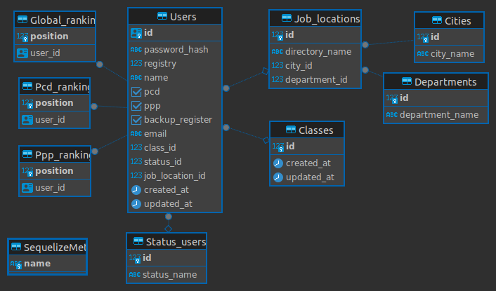

# `Banco de Dados pessoas aprovados no Concurso do Banco do Brasil  2023`

Olá!! Bem vindo ao Banco de dados da nossa aplicação.

Abaixo seguem informações sobre como foi montada a estrutura do banco de dados, que tem como objetivo ser um local seguro para armazenar os dados dos candidatos, e facilitar a consulta pelos demais servicos da aplicação!!

<hr>

## Como contribuir ##
Cada um dos serviços precisa de manutenção, melhoraria de performance e implementação de novas funcionalidades!!
Nos ajude fornecendo seu conhecimento e habilidades para implementar uma plataforma mais interessante e performática.

  > Para contribuir:
  >
  > 1. Escolha um ou mais serviços que tenha interesse em participar,
  >
  > 2. Leia o README.md do(s) serviço(s),
  >  
  > 3. Se estiver de acordo com os padrões de projeto utilizado, pode começar a escrever código :thumbsup:

:loudspeaker: **IMPORTANTE** :loudspeaker:

:telephone: [Não se esqueca de entrar em contato conosco.](#contatos) :telephone:

Informações sobre contato no menu abaixo :point_down::point_down::point_down:

<hr>

<details>

  <summary>
    <strong>
      <h3>
        Termos e acordos gerais
      </h3>
    </strong>
  </summary>

Aos interessados em particiar do projeto, segue abaixo as recomendações e regras a serem seguidas pelos contribuidores.
  - Cada serviço tem suas regras e recomendações específicas, consulte o README.md de cada serviço para mais detalhes.
  - Padrões de projeto devem ser seguidos, a fim de se evitar conflitos.
  - Para todos os serviços utilizamos a estrutura de [Git](https://blog.rocketseat.com.br/iniciando-com-git-github/) e [Git Flow](https://medium.com/trainingcenter/utilizando-o-fluxo-git-flow-e63d5e0d5e04).
  - Todos os serviços se integram através de containers [docker](https://www.docker.com/) - para mais informações sobre containers [docker / docker compose / docker-cli](https://docs.docker.com/get-started/overview/) consulte a documentação.
  - Pull requests seomente serão mergeados após aprovação de pelo menos 1 (um) outro colaborador.

</details>

<hr>

<details>

  <summary>
    <strong>
      <h3>
        Termos e acordos do banco de dados
      </h3>
    </strong>
  </summary>

O banco utilizado para o projeto escolhido foi o **Postgres**.
Especificações do banco de dados:
  - Relacional;
  - Tabelas terão a primeira letra do nome maiúscula;
  - Tabelas terão o nome no prefencialmente no plural;
  - [Snake case](https://en.wikipedia.org/wiki/Snake_case),
  - Todos os nomes das entidades, colunas, tabelas devem estar em inglês
  - 3FN - (3ª forma normal), para mais informações sobre normalização de tabelas acesse [esse link](https://learn.microsoft.com/pt-br/office/troubleshoot/access/database-normalization-description)

#### Qualquer alteração da modelagem do banco de dados deverá seguir as especificações acima mencionadas. ####

## Estrutura ##
O Banco está normalizado até a 3ª forma normal (3FN).
A entidades existentes no banco são:
  - Usuários (todos os aprovados no certame) - `Users`;
  - Ranking global (classificação de todos os usuários) - `Global_ranking`;
  - Ranking PCD (classificação exclusiva dos usuários PCD - Pessoa Com Deficiência) - `Pcd_ranking`;
  - Ranking PPP (classificação exclusiva dos usuários PPP - Pessoa Preta ou Parda) - `Ppp_ranking`;
  - Status do usuário (ultimo status do usuário na lista de convocação) - `Status_users`
  - Lotação (departamente e localidade do usuário convocado) - `Job_locations`
  - Turma (turma de ingresso do usuário para treinamento) - `Classes`
  - Cidades (cidades disponíveis para lotação do usuário convocado) - `Cities`
  - Departamento (departamentos disponíveis para lotação do usuário convocado) - `Departments`

  Segue abaixo um diagrama de entidade e relacionamento:

  
  
</details>

<hr>

## Requisitos ##

<details>

  <summary>
    <strong>
      !! Requisitos obrigatórios !!
    </strong>
  </summary>
  
  <br>
  
  1. Docker :red_circle::

       - Para verificar a instalação do `docker` execute no terminal:

         ```
         $ docker --version
         ```

         caso o retorno seja algo como:

         ```
         $ docker: command not found
         ```

         siga pra este link - [Instalação do Docker Engine](https://docs.docker.com/engine/install/) - para realizar a instalação do Docker.

</details>

<br>

<details>
  <summary>
    <strong>
      !! Requisitos opcionais (desejáveis) !!
    </strong>
  </summary>

  <br>

  1. Node.js :green_circle::
     
      - Para verificar a instalação do `node` execute no terminal:

        ```
        $ node --version
        ```

        caso o retorno seja algo como:

        ```
        $ Command 'node' not found, but can be installed with:
        $ sudo apt install nodejs
        ```

        siga pra este link - [Inslação do Node através do NVM](https://github.com/nvm-sh/nvm#installing-and-updating) - para realizar a instalação do node.js.

  <br>

  2. Python versão 3 ou superior :green_circle::

       - Para verificar a instalção do `python3` execute no terminal:

         ```
         $ python3 --version
         ```

         caso o retorno seja algo como:

         ```
         $ command not found: python
         ```

         siga para esse link - [Instalação do python](https://wiki.python.org/moin/BeginnersGuide/Download) - para realizar a instalação do python 3 ou superior.
  
</details>

<hr>

## Iniciando a aplicação ##

<details>

   <summary>
     <strong>
       ‼ Primeros passos !!
     </strong>
   </summary>

  <br>

   1. Clone o repositório
      
      - Use um dos comandos abaixo:
        - `git clone git@github.com:TheWonderRat/quem_ta_on_no_bb.git`
        - `git clone https://github.com/TheWonderRat/quem_ta_on_no_bb.git`
      - Entre na pasta do repositório que você acabou de clonar:
        - `cd quem_ta_on_no_bb`
      - Entre na pasta do banco de dados:
        - `cd database` 

  <br>
   
  2. Crie um arquvivo `.env`:
   
      - Use o comando abaixo para criar um arquivo `.env` para definir as variáveis de ambiente:

        ```
        $ touch .env
        ```
    
      - Abra o arquivo `.env` no editor de códido de sua preferência e defina as seguintes variáveis de ambiente:

        ```
        1.  PORT_DB=defina_uma_porta
        2.  POSTGRES_USER=defina_um_usuário
        3.  POSTGRES_PASSWORD=defina_uma_senha
        4.  POSTGRES_DB=defina_o_nome_do_db
        ```

      - dentro do diretório há um arquivo de nome `.env.example` a título ilustrativo.
        
      - caso não tenha familiaridae com alguma das variáveis de ambiente citadas acima consulte:
          - [PostgresSQL](https://www.postgresql.org/docs/16/tutorial.html) ou [docker-postgres](https://hub.docker.com/_/postgres)

  <br>
  
  3. Inicie o conatainer do banco de dados com o Docker:

       - Use os comandos:

         ```
         $ docker build -t database .
         $ docker run --name db --env-file .env -p 5432:5432 -v ./data:/var/lib/postgresql/data --rm --network=aprovados_bb -d database
         ```

  <br>
  
  4. Após todo o processamento, e esperado que o banco de dados esteja operacional.
     - Para verificar o funcionando do service inicie alguma aplicação para acesso ao banco. Ex.: [Dbeaver](https://dbeaver.io/download/), [pgAdmin](https://www.pgadmin.org/)
     - Caso queria acessar via terminal use os comandos:

       ```
       $ docker exec -i -t db sh
       $ psql -U $POSTGRES_USER -d $POSTGRES_DB -h localhost -p 5432 -W
       ```
           
</details>

<hr>

## Contatos ##

<details>
  
### **Envie** uma mensagem para os nossos colaboradores. ###
>  Tire dúvidas!
>
> Proponha mudanças!
>
> Informe que tem interesse em colaborar, e em que parte pode ajudar!
>
> De feedback sobre as implementações!
>
> Nos ajude a fazer essa aplicação algo INCRÍVEL! :star_struck:

Colaboradores :busts_in_silhouette: :

  -  Felipe
      -  :: felipe.raindo+dev@gmail.com
        
      -  :: @feliperaindo
        
      -  :: @feliperaindo
        
      -  :: @sazanh

</details>
